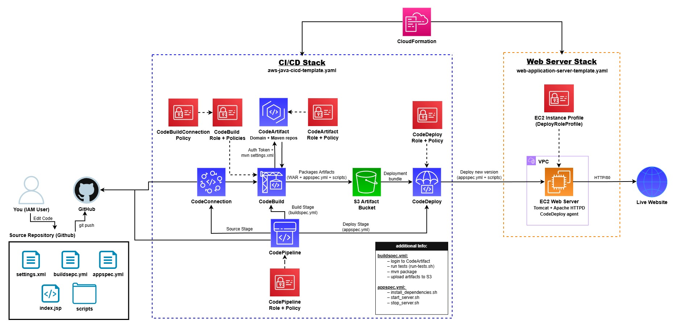

# aws-java-webapp-ci-cd-pipeline

A complete end-to-end CI/CD pipeline on AWS for a Java web application.

This project shows how to take a Java web app from source code in GitHub to a running instance on Amazon EC2 using AWS CodePipeline, CodeBuild, CodeDeploy, CodeArtifact, S3, and IAM. Every push to your main branch can trigger a fully automated pipeline that builds, tests, packages, and deploys the application.

Use it as:
- Reference for learning real AWS DevOps workflows
- Fork-and-customize base for your own Java app
- Pattern to adapt for other services or environments

---

## Architecture at a Glance

High level flow:



Infrastructure is split into two CloudFormation stacks:
- **Web Application Server stack**: Provisions the VPC, subnet, internet gateway, routing, security group, and a single Amazon Linux 2 EC2 instance for the Java web app.
- **CI/CD stack**: Provisions CodeArtifact, S3 artifact buckets, CodeBuild project, CodeDeploy application and deployment group, IAM roles, and CodePipeline that wires GitHub -> Build -> Deploy.

## Features
- Java web application built and packaged with Maven.
- Simple smoke tests executed in the CI stage.
- Private dependency resolution through AWS CodeArtifact.
- Build and package phase fully handled by AWS CodeBuild.
- Artifacts stored in S3 and deployed with AWS CodeDeploy.
- CodePipeline wires the entire flow from GitHub to EC2.
- CloudFormation templates for repeatable environment setup.
- IAM roles and managed policies for least privilege access.

## Tech Stack
- **Application**
  - Language: Java
  - Build tool: Maven
  - Packaging: WAR file
  - App style: Simple JSP / Servlet style web app
- **DevOps / Cloud**
  - Source: GitHub
  - CI: AWS CodeBuild
  - CD: AWS CodeDeploy
  - Orchestration: AWS CodePipeline
  - Artifact storage: Amazon S3
  - Package registry: AWS CodeArtifact (for Maven dependencies)
  - Compute: Amazon EC2 (Amazon Linux 2)
  - IAM: Service roles, instance profiles, managed policies
  - IaC: AWS CloudFormation

## Repository Layout (recommended)
```
aws-java-webapp-ci-cd-pipeline/
├─ src/
│  └─ main/
│     ├─ java/                # Java source code
│     └─ webapp/              # JSPs, static assets, WEB-INF, etc.
├─ scripts/
│  ├─ install_dependencies.sh # Installs Tomcat, HTTPD, configures web server
│  ├─ start_server.sh         # Starts Tomcat + HTTPD
│  └─ stop_server.sh          # Stops HTTPD + Tomcat
├─ buildspec.yml              # CodeBuild configuration
├─ appspec.yml                # CodeDeploy configuration (files + hooks)
├─ run-tests.sh               # Simple smoke tests for CI
├─ pom.xml                    # Maven project definition
├─ settings.xml               # Maven settings wired to CodeArtifact via env vars
├─ web-application-server-template.yaml    # CloudFormation: VPC + EC2 web server
└─ aws-java-webapp-cicd-template.yaml      # CloudFormation: CI/CD stack

```
You can adjust exact locations, but this is the recommended layout.

## Quick Start (TL;DR)
Already familiar with the AWS console? Short version:
1. Fork and clone this repo to your GitHub account.
2. Deploy `web-application-server-template.yaml` in CloudFormation to create the VPC, security group, and EC2 web server (set `MyIP` to your IP).
3. Create a GitHub connection in AWS Developer Tools (CodeConnections / CodeStar) and copy its ARN.
4. Deploy `aws-java-webapp-cicd-template.yaml` in CloudFormation with:
   - `AppName` (keep default or pick a short, no-space base name)
   - `GitHubRepoOwner` (your GitHub username)
   - `GitHubRepo` (this repository name)
   - `GitBranchName` (for example main)
   - `CodeStarConnectionArn` (from step 3)
5. Install the CodeDeploy agent on the EC2 instance from step 2 (one time).
6. Push a new commit to your branch and watch CodePipeline run Source -> Build -> Deploy.
7. Grab the URL output from the web application server stack and open it in your browser.

The sections below go into detail.

## Prerequisites
You will need:
- AWS account with permissions for: CloudFormation stacks; EC2 instances, VPC, subnets, security groups; S3 buckets; CodeArtifact domain and repos; CodeBuild, CodeDeploy, CodePipeline; IAM roles and managed policies.
- GitHub account.
- Git installed locally.
- AWS CLI configured locally (optional but recommended for debugging).

## Step-by-Step Guide

### Step 1: Fork and clone the repo
Fork this project into your own GitHub account, then:
```bash
git clone https://github.com/<your-username>/aws-java-webapp-ci-cd-pipeline.git
cd aws-java-webapp-ci-cd-pipeline
```
Ensure the default branch name in GitHub (main or master) matches what you plan to use in the CI/CD stack parameters.

### Step 2: Deploy the Web Application Server stack
Template: `web-application-server-template.yaml`

Creates:
- VPC with public subnet
- Internet gateway and route table
- Security group that allows HTTP on port 80 from your IP
- IAM role and instance profile with SSM and S3 read permissions
- Single Amazon Linux 2 EC2 instance tagged `role=webserver`
- CloudFormation output URL with the `http://<public-ip>` of the instance

Console steps:
- Go to CloudFormation, create new stack (with new resources), upload the template.
- Set parameters: `MyIP` = your IP in `x.x.x.x/32` (find via https://checkip.amazonaws.com/).
- Leave `AmazonLinuxAMIID` default unless you must change it.
- Create stack, wait for `CREATE_COMPLETE`, then note the URL in Outputs.

Resulting EC2 instance has profile `DeployRoleProfile`, HTTP-only-from-your-IP security group, and tag `role=webserver` so CodeDeploy can target it.

### Step 3: Create a GitHub connection (CodeConnections / CodeStar)
- In AWS console: Developer Tools -> Connections.
- Create connection (provider GitHub), authorize, then copy its ARN `arn:aws:codeconnections:region:account-id:connection/...`.
- You will paste this ARN into the `CodeStarConnectionArn` parameter of the CI/CD stack.

### Step 4: Deploy the CI/CD stack
Template: `aws-java-webapp-cicd-template.yaml`

Creates:
- CodeArtifact domain: `${AppName}-domain`
- CodeArtifact repos: `maven-central-store` (proxy to Maven Central) and `${AppName}-packages` (for your app)
- S3 buckets: `${AppName}-build-artifacts-<account>-<region>` plus an auto-generated CodePipeline artifacts bucket
- IAM roles and policies for CodeBuild, CodeDeploy, CodePipeline, CodeArtifact consumers
- CodeBuild project: name `AppName`, source `https://github.com/${GitHubRepoOwner}/${GitHubRepo}`, buildspec `buildspec.yml`
- CodeDeploy application and deployment group: `CodeDeploy-${AppName}-application` and `${AppName}-deployment-group` targeting EC2 instances tagged `role=webserver`
- CodePipeline: Source (GitHub via CodeStar connection) -> Build (CodeBuild) -> Deploy (CodeDeploy)

Console parameters:
- `AppName`: short, no spaces (default `aws-java-webapp-cicd`)
- `GitHubRepoOwner`: your GitHub username or org
- `GitHubRepo`: repository name, e.g., `aws-java-webapp-ci-cd-pipeline`
- `GitBranchName`: branch that will trigger the pipeline (main or master)
- `CodeStarConnectionArn`: from step 3

Note: `buildspec.yml` and `settings.xml` expect CodeArtifact domain `aws-java-webapp-cicd-domain` and repo `aws-java-webapp-cicd-packages`. If you change `AppName`, update those names accordingly. Create the stack and wait for `CREATE_COMPLETE`.

### Step 5: Install the CodeDeploy agent on the EC2 instance
On your web server instance (SSH or SSM):
```bash
sudo yum update -y
sudo yum install -y ruby wget
cd /home/ec2-user
wget https://aws-codedeploy-<region>.s3.<region>.amazonaws.com/latest/install
chmod +x ./install
sudo ./install auto
sudo systemctl enable codedeploy-agent
sudo systemctl start codedeploy-agent
sudo systemctl status codedeploy-agent
```
Replace `<region>` with your AWS region (e.g., `us-east-1`). Ensure the instance keeps tag `role=webserver`.

### Step 6: Trigger the pipeline
Commit and push any change:
```bash
git add .
git commit -m "Trigger initial CI/CD pipeline run"
git push origin <your-branch-name>
```
Open CodePipeline (pipeline name `${AppName}-cicd`) to watch Source -> Build -> Deploy. When Deploy is green, open the URL from the web application server stack Outputs to see the app running.

## How the code and config work together
- **Maven project (`pom.xml`)**: Defines a simple Java web app packaged as a WAR. `finalName` is `aws-java-webapp-cicd-project`, giving `target/aws-java-webapp-cicd-project.war` used in `appspec.yml`.
- **CodeArtifact integration (`settings.xml` + env vars)**: Maven server id `codeartifact-repo`; uses env vars `CODEARTIFACT_DOMAIN`, `CODEARTIFACT_REPOSITORY`, `ACCOUNT_ID`, `AWS_REGION`, `CODEARTIFACT_AUTH_TOKEN` populated by `buildspec.yml` in `pre_build`.
- **CodeBuild configuration (`buildspec.yml`)**:
  - `install`: sets Java runtime (Corretto 8).
  - `pre_build`: logs into CodeArtifact; exports env vars for `settings.xml`.
  - `build`: makes `run-tests.sh` executable and runs it for simple validation tests (failures stop the pipeline).
  - `post_build`: runs `mvn package -s settings.xml` to build the WAR using CodeArtifact; packages app and deployment config for CodeDeploy.
  - Artifacts uploaded: `target/*.war`, `appspec.yml`, `scripts/**/*` with `discard-paths: no`.
- **CodeDeploy configuration (`appspec.yml` + scripts/)**:
  - Deploys `source: /target/aws-java-webapp-cicd-project.war` to `destination: /usr/share/tomcat/webapps/`.
  - Hooks: `BeforeInstall` -> `scripts/install_dependencies.sh`; `ApplicationStart` -> `scripts/start_server.sh`; `ApplicationStop` -> `scripts/stop_server.sh`.
  - Shell scripts: `install_dependencies.sh` installs Tomcat and HTTPD and configures HTTPD as reverse proxy; `start_server.sh` starts/enables Tomcat and HTTPD; `stop_server.sh` stops HTTPD and Tomcat. Customize for your domain/context path or different runtimes if needed.

## Local development
Build and test locally without CI:
```bash
mvn clean package
```
To simulate CodeArtifact locally, export the same env vars that CodeBuild uses and reuse `settings.xml`. For quick local testing, you can point Maven at public Maven Central and skip CodeArtifact.

## Common tweaks
- Change branch used by the pipeline: update the `GitBranchName` parameter in the CI/CD stack and change your default branch in GitHub.
- Use a different app name: change `AppName` in the CI/CD stack, and update `CODEARTIFACT_DOMAIN` and `CODEARTIFACT_REPOSITORY` in `buildspec.yml` and `settings.xml`.
- Open the app to the internet instead of a single IP: modify the security group in `web-application-server-template.yaml` to allow `0.0.0.0/0` on port 80 (only if you understand the security impact).
- Replace Tomcat with another runtime: change the deployment destination in `appspec.yml`, and update `install_dependencies.sh`, `start_server.sh`, and `stop_server.sh` accordingly.

## Troubleshooting basics
- Pipeline stuck on Source: check CodeStar connection status is `Available`; confirm `GitHubRepoOwner`, `GitHubRepo`, and `GitBranchName`.
- Build failing: open CodeBuild logs; verify `CODEARTIFACT_DOMAIN` and `CODEARTIFACT_REPOSITORY` match your CloudFormation resources; ensure the CodeBuild IAM role can access CodeArtifact and S3; confirm `run-tests.sh` passes.
- Deploy failing: ensure `codedeploy-agent` is running and the instance is tagged `role=webserver`; inspect `/var/log/aws/codedeploy-agent/codedeploy-agent.log` and `/opt/codedeploy-agent/deployment-root/.../logs/scripts.log`; ensure scripts exit with code 0.

## Cost and cleanup
This project uses: one small EC2 instance; two or more S3 buckets; CodeBuild runs; CodePipeline executions; CodeArtifact storage and requests. In a personal account, remember to stop/terminate the EC2 instance when idle, delete CloudFormation stacks when done, empty/delete S3 buckets, and delete CodeArtifact repos if no longer needed.


